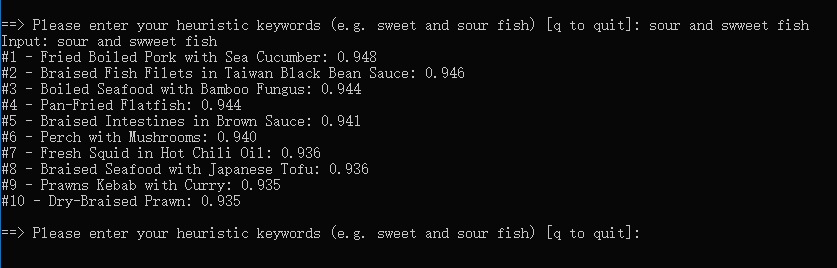

# Food  
This is a group project for CS229, categorized in Natural Language Process.

More details would be in this [poster](https://drive.google.com/open?id=1J7tbJdQwfu4JX3Rdc_TM-nX2g2fifUBA).

## Motivation

While  there  are  a  lot  of  recommendation  systems  for  movies,  audios,  books,  or  restaurants,  surprisingly  there  is 
hardly any for dishes.  As food lovers, we intend to address this issue by exploring models for recommending Chinese dishes to users.  
We scraped data from a popular Chinese recipe website/app called [Xia Chu Fang Cooking Recipe](https://www.xiachufang.com/),  and  
implemented  word  embedding  algorithms  and  recommendation  systems  algorithms to build our model.  
Specifically, the input to our algorithm are users from Xia Chu Fang and dish names they stored in their favourite list.  
We then use Word2Vec and collaborative filtering to build our recommendation system.Specifically, 
we explore the Skip-Gram model in Word2Vec to calculate dish similarity, and apply the Non-NegativeMatrix Factorization 
and Singular Value Decomposition methods in collaborative filtering to output predicted ratings on dishes, 
which allows generation of top recommendations for users based on predicted ratings.Limiting our dishes to Chinese 
cuisine allows us to take on a more tailored recommendation system, while still maintain a high practical value given 
the rising popularity and diversity of Chinese cuisines.  Through this project, we hope to tackle a less touched topic 
of using Machine Learning for dish recommendation and promote Chinese food.

## Method

### 1. Data crawling

```chef_spider.py```
- Utilize parallel crawling and proxies to fetch data more efficiently
- We run this spider on Google Cloud, which created two virtual machines and each contains 8vCPUs.

### 2. Map to fixed dictionary

```preprocess.py```
- Map users' favorite recipes into a fixed-length dictionary, which has 1871 unique keys representing recipe names.
- This dictionary also has corresponding english translation of each dish's chinese recipe name.

### 3. Train models

#### Word2Vec
This content-based method could tackle the issue of a cold start, and intuitively gives us recommendations based on
- your input keywords   
- other users appetites in our database

```word2vec.py```

Usage
1. Suppose you have downloaded our repo including the models in the `models` directory.
2. Then you just need to execute this script by typing `python word2vec.py`

This is our sample output:



Tips
- You may need to install some dependencies by run `pip install -r requirements.txt`.
- If you really don't want to see any warnings, you can simply use this command `python -W ignore word2vec.py`.
- The visualization by T-SNE is in the `res` folder, you can see the two figures ([here](res/word_tsne_full_1.html) and [here](res/word_tsne_full_2.html)) which generated by different seeds.

    Also, we have a [sample](res/word_tsne_small.html) only trained by part data.   

#### Collaborative filter

+ NMF (Non-negative Matrix Factorization)
+ SVD (Singular Value Decomposition)

We implement this idea mainly by **matrix factorization**, which gives us more quantified way to measure our model by recall, see more details [here](collab_filter_analysis.ipynb).

TL;DR;

|     | Dev Set RMSE | Test Set RMSE | Dev Set Recall | Test Set Recall |
|-----|--------------|---------------|----------------|-----------------|
| NMF | 0.4574       | 0.5851        | 0.5081         | 0.5393          |
| SVD | 0.3317       | 0.3634        | 0.9173         | 0.9301          |

